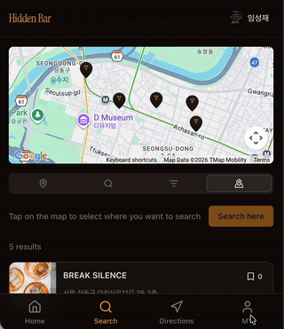
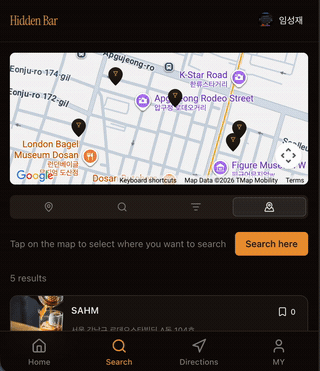
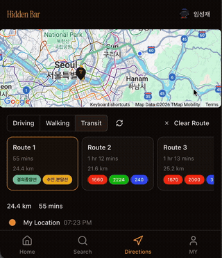
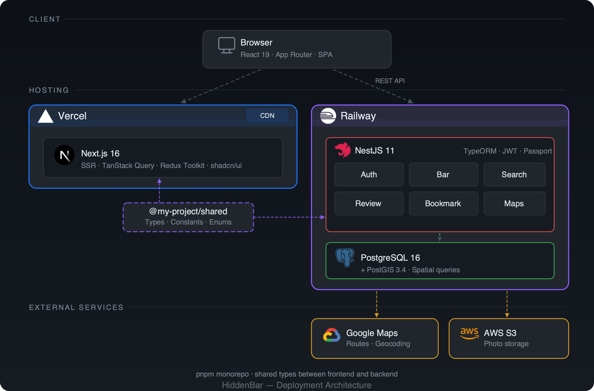

<div align="center">

# HiddenBar

**동남아시아의 숨겨진 로컬 바를 검색하고, 탐색하고, 길안내까지**

[www.hiddenbar.site](https://www.hiddenbar.site)


[개요](#-프로젝트-개요) · [데모](#-데모) · [주요 기능](#-주요-기능) · [아키텍처](#️-아키텍처) · [기술 스택](#️-기술-스택) · [시작하기](#-시작하기) · [문서](#-문서)

</div>

---

## 프로젝트 개요

<div align="center">
  
</div>

<br>

동남아시아를 여행하는 사람들이 현지인들이 찾는 숨겨진 바를 검색해도,
기존 서비스에서는 결과조차 나오지 않는 문제가 있습니다.

**HiddenBar**는 이 문제를 해결하기 위한 프로젝트로,
PostGIS 공간 검색과 Google Routes API를 결합하여
**"검색 → 발견 → 도착"** 까지의 흐름을 하나의 서비스로 제공합니다.

- 여행자가 현재 위치 주변의 로컬 바를 즉시 탐색할 수 있고
- 바의 상세 정보(사진, 메뉴, 영업시간, 리뷰)를 확인한 뒤
- 도보·대중교통·자동차 경로 안내까지 바로 이어집니다

---

## 데모

<table>
<tr>
<td width="33%" align="center">
<b>지도 핀 검색</b><br><br>

</td>
<td width="33%" align="center">
<b>단계별 경로 안내</b><br><br>

</td>
<td width="33%" align="center">
<b>대안 경로</b><br><br>

</td>
</tr>
</table>

---

## 주요 기능

**4가지 검색 모드** — 주소, 이름, 복합 필터, 지도 핀 드롭으로 바를 탐색할 수 있습니다.

**턴바이턴 길안내** — Google Routes API 기반의 도보·대중교통·자동차 경로 안내와 대안 경로를 제공합니다.

**바 상세 정보** — 사진, 메뉴·가격, 영업시간, 사용자 리뷰를 한눈에 확인할 수 있습니다.

**바 등록** — 바 운영자가 직접 매장을 등록하고, 사진을 업로드하며, 정보를 관리할 수 있습니다.

**북마크 & 리뷰** — 마음에 드는 바를 저장하고, 방문 후 리뷰를 남길 수 있습니다.

---

## 아키텍처



---

## 기술 스택

| 분류 | 기술 |
|------|------|
| **백엔드** | NestJS 11, TypeORM, Passport JWT, class-validator, Pino logger |
| **프론트엔드** | Next.js 16 (App Router), React 19, TanStack Query 5, Redux Toolkit 2, React Hook Form + Zod |
| **UI** | Tailwind CSS 4, shadcn/ui (Radix UI), Lucide Icons, Embla Carousel |
| **데이터베이스** | PostgreSQL 16, PostGIS 3.4 |
| **지도 / 위치** | Google Maps API, Google Routes API, @vis.gl/react-google-maps |
| **스토리지** | AWS S3 (@aws-sdk/client-s3) |
| **인증** | JWT (NestJS Passport), bcrypt, Google OAuth |
| **이메일** | Nodemailer, Handlebars 템플릿 |
| **인프라** | Docker Compose, Vercel (프론트엔드), Railway (백엔드) |
| **모노레포** | pnpm 10 workspaces, @my-project/shared 패키지 |
| **테스트** | Jest 30, Supertest, Testing Library, Playwright |

---

## 테스트

| 구분 | 프레임워크 | 스위트 | 테스트 수 |
|------|-----------|--------|----------|
| 백엔드 단위 테스트 | Jest | 41 | 607 |
| 백엔드 E2E | Jest + Supertest | 10 | — |
| 프론트엔드 단위 테스트 | Jest + Testing Library | 26 | 307 |
| 프론트엔드 E2E | Playwright | 10 | 227 |

**백엔드 커버리지** (인프라 코드 제외 기준): Lines 96.90% · Statements 96.76% · Functions 90.79%

자세한 테스트 전략과 시나리오는 [테스트 문서](./docs/testing/)를 참고하세요.

---

## 시작하기

### 사전 요구사항

- **Node.js** ≥ 22
- **pnpm** ≥ 10
- **Docker** (PostgreSQL + PostGIS용)

### 설치

```bash
# 저장소 클론
git clone https://github.com/LSJ0621/hidden-bar.git
cd hidden-bar

# 의존성 설치 (모노레포 루트에서)
pnpm install

# 환경 변수 설정
cp backend/.env.example backend/.env
cp frontend/.env.example frontend/.env
# .env 파일에 API 키(Google Maps, AWS S3 등)를 입력하세요

# Docker로 PostgreSQL + PostGIS 실행
docker compose up -d

# 데이터베이스 마이그레이션 실행
cd backend && pnpm migration:run && cd ..

# 개발 서버 실행
pnpm dev:backend   # 백엔드  → http://localhost:4000
pnpm dev:frontend  # 프론트엔드 → http://localhost:3000
```

---

## 문서

| 문서 | 설명 |
|------|------|
| [아키텍처 개요](./docs/architecture/system-overview.md) | 시스템 아키텍처, API 명세, 데이터베이스 스키마 |
| [프론트엔드 개요](./docs/architecture/frontend-overview.md) | App Router 구조, 컴포넌트, 상태 관리 |
| [API 레퍼런스](./docs/architecture/api/) | 기능 모듈별 엔드포인트 명세 |
| [데이터베이스 스키마](./docs/architecture/database/) | 엔티티 정의, 관계, PostGIS 활용 |
| [테스트 전략](./docs/testing/) | 테스트 인프라, 커버리지 매트릭스, E2E 시나리오 |

