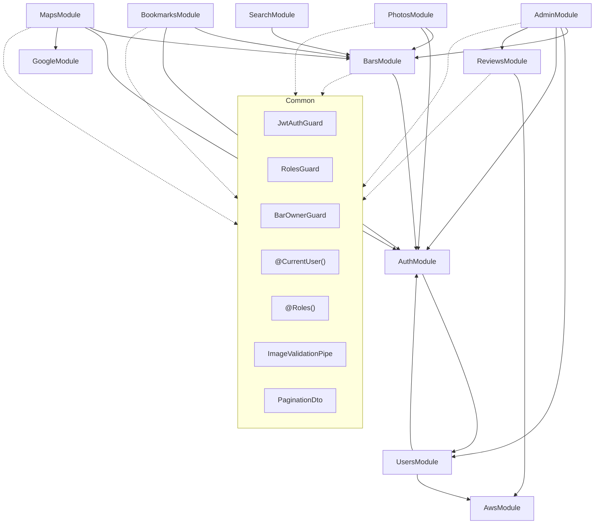

# Hidden Bar - 시스템 개요

> 관련 문서: [API 명세](./api/README.md), [DB 구조](./database/README.md), [프론트엔드 구조](./frontend-overview.md), [문서 안내](../README.md)
> 본 문서는 현재 코드베이스의 시스템 구조와 공통 설정을 통합 정리한 구현 참조 정본이다.
> DB 정책은 개발 환경에서 `dropSchema`와 `synchronize`를 사용하고, 프로덕션에서는 마이그레이션만 사용한다.

---

## 0. 모노레포 구조

```
my-project/
├── package.json              # 루트 (workspace 스크립트)
├── pnpm-workspace.yaml       # workspace 정의
├── backend/                  # @my-project/backend
├── frontend/                 # @my-project/frontend
└── packages/
    └── shared/               # @my-project/shared
        └── src/
            └── enums/        # 공유 enum (Role, BarStatus, DayOfWeek, AdminActionType, ReviewStatus, SearchSortBy, TravelMode, AdminBarsSortBy 등)
```

- workspace 패키지 의존: backend, frontend 모두 `@my-project/shared`를 `workspace:*`로 참조
- 루트 스크립트: `pnpm dev:backend`, `pnpm dev:frontend`, `pnpm build`, `pnpm test`, `pnpm lint`

---

## 0.1 로컬 개발 환경 설정

> 로컬에서 프로젝트를 실행하기 위한 인프라 및 설정 가이드이다.

### Quick Start (전체 로컬 개발 시작 순서)

1. **Docker Compose로 PostgreSQL 실행** — `docker compose up -d`
2. **환경변수 설정** — `.env.example`을 복사하여 `.env` 파일 생성 (backend, frontend 각각)
3. **의존성 설치** — `pnpm install`
4. **DB 마이그레이션 실행** — `cd backend && pnpm typeorm migration:run`
5. **개발 서버 실행** — `pnpm dev:backend` / `pnpm dev:frontend`

### Docker Compose (PostgreSQL)

프로젝트 루트에 `docker-compose.yml`이 필요하다. 주요 설정 항목:

- **이미지**: `postgis/postgis:16-3.4` (PostGIS 포함, 공간 검색 지원)
- **포트**: `5432:5432`
- **환경변수**: `POSTGRES_USER`, `POSTGRES_PASSWORD`, `POSTGRES_DB` (`hiddenbar`)
- **볼륨**: 데이터 영속화를 위한 named volume (`pgdata`)
- **헬스체크**: `pg_isready` 커맨드

> ✅ `docker-compose.yml` 생성 완료 (2026-03-04 인프라 작업)

### 환경변수 설정

- **Backend**: `backend/.env.example` 참조 → `backend/.env`로 복사 후 값 채우기
  - 필수: `DATABASE_URL`, `JWT_SECRET`
  - 선택: `GOOGLE_CLIENT_ID`, `AWS_S3_BUCKET` 등 (외부 서비스 연동 시)
  - 상세 목록은 [섹션 7. 환경변수 통합 목록](#7-환경변수-통합-목록) 참조
- **Frontend**: `frontend/.env.example` 참조 → `frontend/.env`로 복사 후 값 채우기
  - 필수: `NEXT_PUBLIC_API_URL` (기본값: `http://localhost:4000`)
  - 선택: `NEXT_PUBLIC_GOOGLE_CLIENT_ID`, `NEXT_PUBLIC_GOOGLE_MAPS_API_KEY`
  - 상세 목록은 [섹션 7. 환경변수 통합 목록](#7-환경변수-통합-목록) 참조

> ✅ `backend/.env.example`, `frontend/.env.example` 생성 완료 (2026-03-04 인프라 작업)

### DB 마이그레이션 실행

TypeORM CLI를 사용하여 스키마를 생성한다. 자세한 내용은 [섹션 1.1 TypeORM 마이그레이션 관리](#11-typeorm-마이그레이션-관리) 참조.

```bash
cd backend && pnpm typeorm migration:run -d src/data-source.ts
```

---

## 1. 백엔드 모듈 구조

```
backend/src/
├── main.ts                          # 앱 엔트리포인트 (bootstrap)
├── app.module.ts                    # 루트 모듈
├── app.controller.ts                # 루트 컨트롤러 (GET / 헬스 체크)
├── app.service.ts                   # 루트 서비스
├── app.controller.spec.ts
├── data-source.ts                   # TypeORM CLI용 DataSource 설정 파일
│
├── auth/
│   ├── auth.module.ts
│   ├── auth.controller.ts
│   ├── auth.controller.spec.ts
│   ├── auth.service.ts
│   ├── auth.service.spec.ts
│   ├── auth-password.service.ts      # 비밀번호 재설정 서비스 (verificationToken 검증 + 비밀번호 업데이트)
│   ├── auth-password.service.spec.ts
│   ├── cookie.service.ts             # httpOnly 쿠키 설정/삭제 서비스
│   ├── email-notification.service.ts # 이메일 발송 서비스 (@nestjs-modules/mailer, Handlebars 템플릿)
│   ├── email-notification.service.spec.ts
│   ├── email-verification.service.ts # 인증 코드 생성/발송/검증, verificationToken JWT 발급
│   ├── email-verification.service.spec.ts
│   ├── clients/
│   │   ├── google-oauth.client.ts    # Google OAuth HTTP 클라이언트 (@nestjs/axios 기반)
│   │   └── google-oauth.client.spec.ts
│   ├── interfaces/
│   │   └── google-oauth.interface.ts  # GoogleTokenResponse, GoogleUserProfile
│   ├── constants/
│   │   ├── google-oauth.constants.ts  # GOOGLE_TOKEN_URL, GOOGLE_USERINFO_URL, GOOGLE_OAUTH_TIMEOUT
│   │   └── email-verification.constants.ts  # EmailVerificationPurpose enum, CODE_LENGTH, 만료/한도 상수
│   ├── dto/
│   │   ├── signup.dto.ts
│   │   ├── signup.dto.spec.ts
│   │   ├── login.dto.ts
│   │   ├── social-login.dto.ts
│   │   ├── send-code.dto.ts
│   │   ├── verify-code.dto.ts
│   │   └── reset-password.dto.ts
│   ├── guards/
│   │   ├── jwt-auth.guard.ts
│   │   ├── jwt-auth.guard.spec.ts
│   │   ├── roles.guard.ts
│   │   └── roles.guard.spec.ts
│   ├── decorators/
│   │   ├── current-user.decorator.ts
│   │   └── roles.decorator.ts
│   ├── strategies/
│   │   ├── jwt.strategy.ts
│   │   └── jwt.strategy.spec.ts
│   └── types/
│       └── auth-response.type.ts
│
├── users/
│   ├── users.module.ts
│   ├── users.controller.ts
│   ├── users.controller.spec.ts
│   ├── users.service.ts
│   ├── users.service.spec.ts
│   └── dto/
│       ├── update-profile.dto.ts
│       └── change-password.dto.ts
│
├── bars/
│   ├── bars.module.ts
│   ├── bars.controller.ts          # GET /bars/nearby 포함
│   ├── bars.controller.spec.ts
│   ├── bars.service.ts             # findNearby() 메서드 포함
│   ├── bars.service.spec.ts
│   ├── dto/
│   │   ├── create-bar.dto.ts
│   │   ├── update-bar.dto.ts
│   │   ├── my-bars-query.dto.ts
│   │   ├── nearby-bars.dto.ts
│   │   ├── create-menu-item.dto.ts
│   │   └── create-operating-hours.dto.ts
│   └── guards/
│       ├── bar-owner.guard.ts
│       └── bar-owner.guard.spec.ts
│
├── photos/
│   ├── photos.module.ts
│   ├── photos.controller.ts
│   ├── photos.controller.spec.ts
│   ├── photos.service.ts
│   └── photos.service.spec.ts
│
├── bookmarks/
│   ├── bookmarks.module.ts
│   ├── bookmarks.controller.ts
│   ├── bookmarks.controller.spec.ts
│   ├── bookmarks.service.ts
│   └── bookmarks.service.spec.ts
│
├── search/
│   ├── search.module.ts
│   ├── search.controller.ts
│   ├── search.controller.spec.ts
│   ├── search.service.ts
│   ├── search.service.spec.ts
│   ├── search.types.ts             # SearchMode, SearchItem, SearchResult 인터페이스
│   ├── search.mapper.ts            # mapSearchRow() 검색 결과 매핑 함수
│   └── dto/
│       └── search-bars.dto.ts
│
├── maps/
│   ├── maps.module.ts
│   ├── maps.controller.ts
│   ├── maps.controller.spec.ts
│   ├── maps.service.ts
│   ├── maps.service.spec.ts
│   ├── address-search.service.ts    # 주소 검색 (Google Places API v1)
│   ├── address-search.service.spec.ts
│   ├── google-routes.types.ts       # Google Routes API v2 요청/응답 인터페이스 (GoogleLatLng, GoogleRoutesResponse 등)
│   ├── google-routes.constants.ts   # Routes API URL, 타임아웃, 이동수단 매핑, 필드마스크 상수
│   └── dto/
│       ├── directions.dto.ts
│       └── search-address.dto.ts
│
├── external/
│   ├── google/
│   │   ├── google.module.ts          # GooglePlacesClient를 export하는 모듈
│   │   ├── google.constants.ts       # Places API URL, 필드마스크 상수
│   │   ├── google.types.ts           # Autocomplete/Details 응답 타입
│   │   └── clients/
│   │       ├── google-places.client.ts  # Places API 호출 클라이언트
│   │       └── google-places.client.spec.ts
│   ├── aws/
│   │   ├── aws.module.ts              # AwsModule (S3Client export)
│   │   ├── aws.constants.ts           # S3 경로 프리픽스 상수
│   │   └── clients/
│   │       ├── s3.client.ts           # AWS SDK v3 S3Client (upload, delete, uploadReviewPhoto 포함)
│   │       └── s3.client.spec.ts
│   └── mocks/
│       └── mock-s3.client.ts          # 테스트용 Mock S3Client (S3Client와 동일 인터페이스: uploadProfilePhoto, uploadReviewPhoto 포함)
│
├── reviews/
│   ├── reviews.module.ts
│   ├── reviews.controller.ts
│   ├── reviews.controller.spec.ts
│   ├── reviews.service.ts
│   ├── reviews.service.spec.ts
│   ├── review-photos.service.ts     # 리뷰 사진 업로드/삭제 서비스 (S3 의존)
│   ├── review-presenter.ts          # 리뷰 응답 변환 함수 (toReviewItem, toReviewStats)
│   ├── review-stats.service.ts      # 리뷰 통계 갱신 서비스 (incrementStats, decrementStats, adjustRating, adjustPhotoReviewCount)
│   └── dto/
│       ├── create-review.dto.ts
│       ├── update-review.dto.ts
│       ├── list-reviews-query.dto.ts
│       └── moderate-review.dto.ts
│
├── review-reports/
│   ├── review-reports.module.ts
│   ├── review-reports.controller.ts
│   ├── review-reports.controller.spec.ts
│   ├── review-reports.service.ts
│   ├── review-reports.service.spec.ts
│   └── dto/
│       ├── create-report.dto.ts
│       ├── list-reports-query.dto.ts
│       └── resolve-report.dto.ts
│
├── admin/
│   ├── admin.module.ts
│   ├── admin.controller.ts
│   ├── admin.controller.spec.ts
│   ├── admin.service.ts             # 퍼사드 — 5개 서브 서비스에 위임
│   ├── admin.service.spec.ts
│   ├── admin-dashboard.service.ts   # 대시보드 통계, 날짜 헬퍼, 추이 계산
│   ├── admin-bars.service.ts        # 가게 목록/상세/승인/거절/삭제 (BarsService.softDeleteBarWithRelations 활용)
│   ├── admin-users.service.ts       # 유저 목록/상세/정지/활성화/역할 변경
│   ├── admin-reviews.service.ts     # 리뷰 상태 변경/삭제
│   ├── admin-actions.service.ts     # 감사 로그 조회
│   ├── admin-action.helper.ts       # AdminAction 생성 헬퍼 (createAdminAction)
│   ├── admin-target-type.ts         # AdminTargetType enum (BAR, USER, REVIEW)
│   ├── admin.constants.ts           # 대시보드 매직넘버 상수 (DASHBOARD_RECENT_LIMIT 등)
│   ├── dto/
│   │   ├── admin-bars-query.dto.ts
│   │   ├── admin-users-query.dto.ts
│   │   ├── admin-actions-query.dto.ts
│   │   ├── approve-bar.dto.ts
│   │   ├── reject-bar.dto.ts
│   │   ├── delete-bar.dto.ts
│   │   ├── delete-review.dto.ts
│   │   ├── suspend-user.dto.ts
│   │   └── change-role.dto.ts
│
├── seeds/
│   ├── bar-seed.ts              # 개발용 바 시드 데이터 스크립트 (standalone) — 바, 사진, 영업시간, 메뉴 아이템 삽입
│   ├── bar-seed.data.ts         # 바 시드 데이터 집계 — 12개 파트 파일 import 후 barSeedData 배열 export
│   ├── bar-seed.types.ts        # BarSeedData 인터페이스 정의
│   ├── bar-seed-part-01.ts      # 시드 데이터 파트 1~12 (100개 바를 12개 파일로 분할)
│   ├── ...
│   └── bar-seed-part-12.ts
│
├── templates/
│   └── email/
│       └── verification-code.hbs    # 이메일 인증 코드 Handlebars 템플릿
│
├── entities/
│   ├── account.entity.ts
│   ├── admin-action.entity.ts
│   ├── bar-photo.entity.ts
│   ├── bar-review-stats.entity.ts
│   ├── bar.entity.ts
│   ├── bookmark.entity.ts
│   ├── email-verification.entity.ts
│   ├── menu-item.entity.ts
│   ├── operating-hours.entity.ts
│   ├── refresh-token.entity.ts
│   ├── review-photo.entity.ts
│   ├── review-report.entity.ts
│   ├── review.entity.ts
│   └── user.entity.ts
│
├── common/
│   ├── constants/
│   │   └── currency.ts              # 기본 통화 코드 상수 (DEFAULT_CURRENCY)
│   ├── filters/
│   │   ├── all-exceptions.filter.ts      # 전역 예외 필터
│   │   └── all-exceptions.filter.spec.ts
│   ├── config/
│   │   ├── configuration.ts            # ConfigModule 설정 팩토리
│   │   ├── configuration.spec.ts
│   │   ├── env.validation.ts           # 환경변수 검증 (class-validator 기반)
│   │   └── multer.config.ts            # Multer 파일 업로드 설정 (5MB, 10파일)
│   ├── dto/
│   │   ├── pagination.dto.ts
│   │   └── pagination.dto.spec.ts
│   ├── guards/
│   │   ├── user-throttler.guard.ts     # ThrottlerGuard 확장, req.user.id 기반 rate limit
│   │   └── user-throttler.guard.spec.ts
│   ├── subscribers/
│   │   ├── soft-delete-cascade.subscriber.ts
│   │   └── soft-delete-cascade.subscriber.spec.ts
│   ├── utils/
│   │   ├── file-validation.util.ts  # Magic bytes 검증 유틸리티 (JPEG/PNG/WebP)
│   │   ├── user-mapper.ts           # User 엔티티 → UserInfo DTO 변환 (toUserInfo)
│   │   ├── photo-utils.ts           # 사진 배열에서 썸네일 추출 (extractThumbnail)
│   │   ├── pagination.ts            # 페이지네이션 메타 빌더 (buildPaginationMeta) — 7개 서비스에서 공통 사용
│   │   └── transaction.ts           # 트랜잭션 래퍼 유틸리티 (runInTransaction)
│   ├── pipes/
│   │   ├── file-validation.pipe.ts  # MIME + magic bytes 검증 파이프 (ImageValidationPipe)
│   │   └── file-validation.pipe.spec.ts
│   └── init/
│       ├── admin-init.service.ts    # 서버 시작 시 관리자 계정 자동 생성 (OnApplicationBootstrap)
│       ├── trigger-init.service.ts  # 서버 시작 시 bars 테이블 DB 트리거 자동 보장 (OnApplicationBootstrap)
│       └── seed-init.service.ts     # dev 환경 서버 시작 시 바 시드 데이터 자동 삽입 (OnApplicationBootstrap, production 제외) — 바, 사진, 영업시간, 메뉴 아이템 일괄 삽입
│
└── migrations/
    ├── 1709500000000-add-search-vector.ts          # tsvector 컬럼, GIN 인덱스, 트리거 생성
    ├── 1709600000000-add-postgis-location.ts       # PostGIS location 컬럼, GIST 인덱스, lat/lng 동기화 트리거
    ├── 1710000000000-add-trgm-gin-indexes.ts       # pg_trgm 확장, bars.name/address GIN trigram 인덱스 추가
    └── 1711000000000-drop-price-range.ts           # bars 테이블 priceRange 컬럼 및 관련 enum 삭제
```

### 1.1 TypeORM 마이그레이션 관리

#### `data-source.ts` 설정 파일

TypeORM CLI에서 마이그레이션을 실행하려면 별도의 DataSource 설정 파일이 필요하다.

- **파일 위치**: `backend/src/data-source.ts`
- **역할**: TypeORM CLI (`typeorm migration:run`, `migration:generate` 등)가 DB 연결 정보를 읽는 엔트리포인트
- **내용**: `DATABASE_URL` 환경변수를 사용하여 PostgreSQL에 연결하고, 엔티티 및 마이그레이션 파일 경로를 지정
- **주의**: NestJS 앱 내의 `TypeOrmModule.forRoot()` 설정과 동일한 DB 연결 정보를 사용해야 함

> ✅ `backend/src/data-source.ts` 생성 완료 (2026-03-04 인프라 작업)

#### 마이그레이션 CLI 명령어

| 명령어 | 설명 |
|--------|------|
| `pnpm typeorm migration:run -d src/data-source.ts` | 미실행 마이그레이션 적용 |
| `pnpm typeorm migration:revert -d src/data-source.ts` | 가장 최근 마이그레이션 되돌리기 |
| `pnpm typeorm migration:generate -d src/data-source.ts src/migrations/<name>` | 엔티티 변경 기반 마이그레이션 자동 생성 |
| `pnpm typeorm migration:create src/migrations/<name>` | 빈 마이그레이션 파일 생성 (Raw SQL용) |

#### DB 운영 정책

- 개발 환경에서는 `synchronize: true`, `dropSchema: true`를 사용한다.
- 프로덕션 환경에서는 `synchronize: false`, `dropSchema: false`를 사용하고, 스키마 변경은 마이그레이션으로만 관리한다.
- TypeORM CLI용 `src/data-source.ts`는 프로덕션 기준과 같은 `synchronize: false` 상태로 마이그레이션 실행에 사용한다.

#### 마이그레이션 파일 인벤토리

| 파일명 | 설명 | 상태 |
|--------|------|------|
| `1709500000000-add-search-vector.ts` | tsvector 컬럼, GIN 인덱스, 트리거 생성 | 생성 완료 |
| `1709600000000-add-postgis-location.ts` | PostGIS location 컬럼, GIST 인덱스, lat/lng 동기화 트리거 | 생성 완료 |
| `1710000000000-add-trgm-gin-indexes.ts` | pg_trgm 확장, bars.name/address GIN trigram 인덱스 추가 | 생성 완료 |
| `1711000000000-drop-price-range.ts` | bars 테이블 priceRange 컬럼 및 관련 enum 삭제 | 생성 완료 |

> 마이그레이션 파일은 타임스탬프 순서로 실행된다. 새 마이그레이션 추가 시 이 인벤토리도 함께 업데이트한다.

---

## 2. 백엔드 인프라 설정

### 2.0 미들웨어

- `cookie-parser` — `main.ts`에서 `app.use(cookieParser())`로 전역 등록. 모든 요청에서 `req.cookies`로 쿠키를 파싱. JWT 인증 전략에서 `accessToken` 쿠키, Auth 컨트롤러에서 `refreshToken` 쿠키를 읽는 데 사용.

### 2.1 전역 예외 필터 (Global Exception Filter)

- `AllExceptionsFilter` — `@Catch()`로 모든 예외를 포착. HttpException은 기존과 동일하게 `api-spec.md`의 공통 에러 응답 구조(`statusCode`, `message`, `error`)로 변환. 그 외 예상치 못한 예외(TypeError, DB 에러 등)는 500으로 처리하며, production 환경에서는 내부 에러 메시지를 숨긴다. 4xx는 warn 레벨, 5xx 및 unknown은 error 레벨로 스택 트레이스 포함 로깅
- `main.ts`에서 `app.useGlobalFilters()`로 등록
- 응답 형식은 `api-spec.md`의 공통 에러 응답 구조와 일치시킴

### 2.2 환경변수 관리 (ConfigModule)

- `@nestjs/config`의 `ConfigModule.forRoot()`를 `AppModule`에서 글로벌 등록 (`isGlobal: true`)
- `configuration.ts` 팩토리 함수로 환경변수 그룹화 및 타입 정의
- 모든 모듈에서 `process.env` 직접 참조 대신 `ConfigService.get()` 사용
- `.env` 파일 기반, 환경별 `.env.development`, `.env.production` 지원
- 유효성 검증: `class-validator` 기반 `EnvironmentVariables` 클래스로 앱 시작 시 필수 환경변수 검증 (`env.validation.ts`)

### 2.3 구조화 로깅 (nestjs-pino)

- `nestjs-pino`의 `LoggerModule.forRootAsync()`를 `AppModule`에서 글로벌 등록
- `main.ts`에서 `bufferLogs: true` 및 `app.useLogger(app.get(Logger))`로 NestJS 내장 로거를 pino로 교체
- **환경별 포맷**:
  - `production`: 구조화된 JSON 로깅 (transport 없음)
  - `development`: `pino-pretty`를 사용한 사람이 읽기 쉬운 컬러 포맷 (`singleLine: true`, `translateTime: 'SYS:HH:MM:ss.l'`)
- **HTTP 자동 로깅**: `pino-http`가 모든 요청/응답을 자동으로 로깅 (메서드, URL, 상태코드, 응답시간)
- **Request ID 추적**: 요청 헤더 `x-request-id`가 있으면 그 값을 로깅용 `reqId`로 사용하고, 없으면 UUID를 생성하여 응답 헤더 `x-request-id`에 설정하여 반환. 클라이언트가 보낸 `x-request-id`는 응답 헤더에 포함되지 않는다
- **로그 레벨**: `LOG_LEVEL` 환경변수로 제어 (기본값: `info`)

---

> 프론트엔드 페이지/컴포넌트 구조, 라우트 맵, 상태 관리는 [docs/architecture/frontend-overview.md](./frontend-overview.md) 참조

---

## 3. 모듈별 책임 요약

### 백엔드 모듈

| 모듈 | 주요 파일 | 책임 |
|------|-----------|------|
| **AuthModule** | `auth.controller.ts`, `auth.service.ts`, `auth-password.service.ts`, `cookie.service.ts`, `email-notification.service.ts`, `email-verification.service.ts`, `jwt.strategy.ts`, `clients/google-oauth.client.ts` | 이메일/소셜 회원가입 및 로그인, JWT 발급/갱신/폐기, httpOnly 쿠키 설정/삭제 (CookieService), Passport 전략 관리, Google OAuth 클라이언트 (`@nestjs/axios` 기반), 이메일 인증 코드 발송/검증 (EmailVerificationService + EmailNotificationService), 비밀번호 재설정 (AuthPasswordService), MailerModule (Handlebars 템플릿 기반) |
| **UsersModule** | `users.controller.ts`, `users.service.ts` | 프로필 조회/수정, 비밀번호 변경, 프로필 이미지 업로드 (S3) |
| **BarsModule** | `bars.controller.ts`, `bars.service.ts`, `bar-owner.guard.ts` | 가게 CRUD, 소유자 권한 검증, 근처 바 검색 (PostGIS ST_DWithin/ST_Distance). update 시 menuItems/operatingHours 트랜잭션 기반 교체 지원. `softDeleteBarWithRelations()` — 바와 연관 엔티티(사진·메뉴·영업시간·리뷰·북마크·통계) 일괄 소프트 삭제 (AdminModule에서도 활용) |
| **PhotosModule** | `photos.controller.ts`, `photos.service.ts` | S3 사진 업로드/삭제, 파일 검증. 전체 업로드 실패 시 `BadGatewayException` 반환. 프로필 이미지 교체 순서: 새 업로드 → DB 저장 → 기존 삭제 (삭제 실패 시 로그만 기록) |
| **BookmarksModule** | `bookmarks.controller.ts`, `bookmarks.service.ts` | 북마크 추가(`PUT`, 멱등) / 제거(`DELETE`, 멱등), 내 북마크 목록 조회. 응답에 `isBookmarked`와 `bookmarkCount` 포함 |
| **SearchModule** | `search.controller.ts`, `search.service.ts`, `search.types.ts`, `search.mapper.ts` | 3가지 검색 모드 지원: 주소만(address) · 이름만(name) · 주소+이름(combined). 모드는 파라미터 조합(`lat`/`lng`, `name`)으로 자동 판별. pg_trgm `similarity() > 0.2` 기반 퍼지 매칭, PostGIS ST_DWithin 거리 필터. 일반 목록 모드(`sortBy`)로 홈페이지 호환 유지. 응답에 `hasMore`/`mode`/`center`/`radiusKm` 포함. 타입 정의(`search.types.ts`)와 결과 매핑(`search.mapper.ts`) 분리 |
| **MapsModule** | `maps.controller.ts`, `maps.service.ts`, `address-search.service.ts` | Google Routes API v2 프록시 (`@nestjs/axios` HttpService 기반), 경로 계산, 주소 검색 (Google Places API v1), Rate Limiting. 프론트엔드에서 경로 탭(`/directions`)을 통해 호출 (이전: 바 상세 DirectionsSheet) |
| **GoogleModule** | `external/google/clients/google-places.client.ts` | Google Places API v1 호출 클라이언트 (`@nestjs/axios` HttpService 기반, Autocomplete, Details) |
| **ReviewsModule** | `reviews.controller.ts`, `reviews.service.ts`, `review-photos.service.ts`, `review-presenter.ts`, `review-stats.service.ts` | 리뷰 CRUD, bar_review_stats 통계 관리 (ReviewStatsService). 리뷰 사진 업로드/삭제는 ReviewPhotosService로 분리 (S3 의존). 응답 변환은 review-presenter.ts (toReviewItem, toReviewStats). 리뷰 생성/삭제/수정 시 트랜잭션 내에서 통계 동기적 갱신 |
| **ReviewReportsModule** | `review-reports.controller.ts`, `review-reports.service.ts` | 리뷰 신고 접수 (사용자) 및 신고 관리 (관리자). 신고 목록/상세 조회, 신고 처리 (RESTORED/HIDDEN/DELETED). ReviewsModule, AdminModule 의존 |
| **AdminModule** | `admin.controller.ts`, `admin.service.ts` (퍼사드), `admin-dashboard.service.ts`, `admin-bars.service.ts`, `admin-users.service.ts`, `admin-reviews.service.ts`, `admin-actions.service.ts`, `admin-action.helper.ts`, `admin-target-type.ts`, `admin.constants.ts` | 퍼사드 패턴 — AdminService가 5개 서브 서비스에 위임. 대시보드 통계 (AdminDashboardService), 가게 승인/거절/삭제 (AdminBarsService, BarsModule 의존), 유저 정지/활성화/역할 변경 (AdminUsersService), 리뷰 상태 변경/삭제 (AdminReviewsService), 감사 로그 (AdminActionsService). 공통 감사 로그 생성 헬퍼 (createAdminAction) |
| **Common** | `pagination.dto.ts`, `file-validation.pipe.ts`, `soft-delete-cascade.subscriber.ts`, `all-exceptions.filter.ts`, `configuration.ts`, `admin-init.service.ts`, `trigger-init.service.ts`, `seed-init.service.ts`, Guards, Decorators, `user-mapper.ts`, `photo-utils.ts`, `pagination.ts`, `transaction.ts`, `constants/currency.ts` | 공통 DTO, 파이프, 가드, 데코레이터, soft delete cascade subscriber, 전역 예외 필터 (AllExceptionsFilter), 환경변수 설정 (ConfigModule), 초기 관리자 계정 생성 (AdminInitService), bars 테이블 DB 트리거 + pg_trgm 확장/인덱스 자동 보장 (TriggerInitService: `ensureSearchVectorTrigger`, `ensureLocationTrigger`, `ensurePgTrgmExtensionAndIndex`), dev 환경 바·사진·영업시간·메뉴 아이템 시드 데이터 자동 삽입 (SeedInitService), 공통 유틸 (toUserInfo, extractThumbnail, buildPaginationMeta, runInTransaction), 공통 상수 (DEFAULT_CURRENCY) |

---

## 4. 모듈 간 의존 관계



### 의존 관계 상세

| 소스 모듈 | 대상 모듈 | 사용 내용 |
|-----------|-----------|-----------|
| `AdminModule` | `BarsModule` | Bar 조회, 상태 변경 (APPROVED/REJECTED), soft delete |
| `AdminModule` | `UsersModule` | User 조회, 정지/활성화/역할 변경 |
| `AdminModule` | `ReviewsModule` | ReviewStatsService 사용 (리뷰 삭제 시 통계 갱신) |
| `ReviewsModule` | `AwsModule` | 리뷰 사진 S3 업로드 (uploadReviewPhoto) |
| `PhotosModule` | `BarsModule` | 사진 업로드 대상 Bar 존재 및 소유자 확인 |
| `BookmarksModule` | `BarsModule` | 북마크 대상 Bar 존재 확인 (APPROVED 상태만) |
| `SearchModule` | `BarsModule` | Bar 데이터 검색 (3가지 모드: 주소/이름/복합 + pg_trgm 퍼지 매칭 + PostGIS 거리 필터) |
| `MapsModule` | `BarsModule` | 근처 바 검색 시 Bar 데이터 조회 |
| `MapsModule` | `GoogleModule` | 주소 검색 시 Google Places API 호출 |
| `AuthModule` | `UsersModule` | 회원가입 시 User 생성, 로그인 시 User 조회 |
| `UsersModule` | `AuthModule` | JWT 인증 가드 사용 |
| `UsersModule` | `AwsModule` | 프로필 이미지 S3 업로드 |

---

## 5. 공통 모듈 (Common)

### Guards

| Guard | 위치 | 설명 |
|-------|------|------|
| `JwtAuthGuard` | `auth/guards/jwt-auth.guard.ts` | `@nestjs/passport`의 `AuthGuard('jwt')` 확장. `accessToken` httpOnly 쿠키에서 JWT를 읽어 검증한다 |
| `RolesGuard` | `auth/guards/roles.guard.ts` | `@Roles(Role.ADMIN)` 데코레이터와 함께 사용. `Reflector`로 필요 역할 확인 후 `user.role`과 비교 |
| `BarOwnerGuard` | `bars/guards/bar-owner.guard.ts` | `barId` 파라미터로 Bar 조회 후 `request.user.id === bar.ownerId` 확인. 바 미존재 시 `404 Not Found`, 소유자 불일치 시 `403 Forbidden` |
| `UserThrottlerGuard` | `common/guards/user-throttler.guard.ts` | `ThrottlerGuard` 확장. `req.user.id` 기반 rate limit을 적용한다. 인증되지 않은 요청에는 IP fallback. `JwtAuthGuard` 이후에 실행되어야 한다 |

### Decorators

| Decorator | 위치 | 설명 |
|-----------|------|------|
| `@CurrentUser()` | `auth/decorators/current-user.decorator.ts` | `request.user`에서 유저 정보를 추출하는 파라미터 데코레이터 |
| `@Roles()` | `auth/decorators/roles.decorator.ts` | 엔드포인트에 필요한 역할을 메타데이터로 설정 |

### Pipes

| Pipe | 위치 | 설명 |
|------|------|------|
| `ImageValidationPipe` | `common/pipes/file-validation.pipe.ts` | multer 파일 업로드 시 이미지 형식(JPEG, PNG, WebP) 및 크기(5MB) 검증. 단일 파일(`Express.Multer.File`)과 배열(`Express.Multer.File[]`) 모두 처리 가능 |

### DTOs

| DTO | 위치 | 설명 |
|-----|------|------|
| `PaginationDto` | `common/dto/pagination.dto.ts` | `page`, `limit` 공통 쿼리 파라미터 (기본값: page=1, limit=20) |

### JWT 설정

| 항목 | 값 |
|------|-----|
| Access Token 만료 | 15분 |
| Refresh Token 만료 | 7일 |
| 서명 알고리즘 | HS256 |
| Payload | `{ sub: userId, email, role }` |

---

## 6. 외부 패키지 의존성 통합 목록

### 백엔드 패키지

| 패키지 | 용도 | 담당 스펙 |
|--------|------|-----------|
| `cookie-parser` | HTTP 쿠키 파싱 미들웨어 | SPEC-01 |
| `@nestjs/jwt` | JWT 토큰 생성/검증 | SPEC-01 |
| `@nestjs/passport` | Passport.js NestJS 통합 | SPEC-01 |
| `passport-jwt` | JWT 인증 전략 | SPEC-01 |
| `@nestjs/axios` | HTTP 클라이언트 (Google OAuth, Places API, Routes API 등 모든 외부 HTTP 호출) | SPEC-01, SPEC-04 |
| `axios` | HTTP 클라이언트 라이브러리 (@nestjs/axios 의존) | SPEC-01, SPEC-04 |
| `bcrypt` | 비밀번호 해싱 | SPEC-01 |
| `class-validator` | DTO 유효성 검증 | SPEC-01 (전역) |
| `class-transformer` | DTO 변환 | SPEC-01 (전역) |
| `@aws-sdk/client-s3` | S3 사진 업로드 | SPEC-02 |
| `multer` | 파일 업로드 처리 | SPEC-02 |
| *(삭제됨: native fetch)* | Routes API v2 호출은 `@nestjs/axios` HttpService로 통일 | SPEC-04 |
| `uuid` | 파일 키 생성 (S3 업로드 경로) | SPEC-02 |
| `@nestjs/throttler` | API Rate Limiting | SPEC-04 |
| `@nestjs/config` | 환경변수 관리 (ConfigModule/ConfigService) | 공통 (전역) |
| `nestjs-pino` | NestJS pino 로거 통합 (LoggerModule) | 공통 (전역) |
| `pino-http` | HTTP 요청/응답 자동 로깅 | 공통 (전역) |
| `pino` | 고성능 JSON 로거 (nestjs-pino 의존) | 공통 (전역) |
| `pino-pretty` (devDep) | 개발 환경 로그 포맷터 | 공통 (개발) |
| `@nestjs-modules/mailer` | NestJS 이메일 발송 모듈 (MailerModule) | SPEC-01 |
| `nodemailer` | SMTP 이메일 전송 라이브러리 (@nestjs-modules/mailer 의존) | SPEC-01 |
| `handlebars` | 이메일 템플릿 엔진 (Handlebars) | SPEC-01 |

### 프론트엔드 패키지

| 패키지 | 용도 | 담당 스펙 |
|--------|------|-----------|
| `@reduxjs/toolkit` + `react-redux` | 인증 상태 관리 (useAuthStore) | SPEC-01 |
| `@tanstack/react-query` | 서버 상태 관리 (useQuery, useMutation) | SPEC-01 (전역) |
| `axios` | HTTP 클라이언트 + interceptor | SPEC-01 (전역) |
| `react-hook-form` | 폼 상태 관리 | SPEC-01 (전역) |
| `zod` | 프론트엔드 유효성 검증 | SPEC-01 (전역) |
| `@hookform/resolvers` | react-hook-form + zod 연동 | SPEC-01 (전역) |
| `@vis.gl/react-google-maps` | Google Maps React 컴포넌트 (Google 공식) | SPEC-02, SPEC-04 |
| `react-dropzone` | 드래그앤드롭 파일 업로드 | SPEC-02 |
| `nuqs` | URL search params 상태 관리 (Next.js App Router 호환) | SPEC-03 |
| `recharts` | 대시보드 차트 (국가별 통계) | SPEC-05 |
| `@tanstack/react-table` | 관리자 테이블 (정렬, 필터, 페이지네이션) | SPEC-05 |
| `@playwright/test` (devDep) | 프론트엔드 E2E 테스트 (Playwright) | 테스트 인프라 |

---

## 7. 환경변수 통합 목록

> 모든 환경변수는 `@nestjs/config`의 `ConfigModule`을 통해 관리한다.
> `process.env` 직접 참조 대신 `ConfigService`를 주입받아 사용한다.

### 백엔드 환경변수

| 변수명 | 설명 | 담당 스펙 | 예시 |
|--------|------|-----------|------|
| `POSTGRES_HOST` | PostgreSQL 호스트 | 공통 | `localhost` |
| `POSTGRES_PORT` | PostgreSQL 포트 | 공통 | `5432` |
| `POSTGRES_USER` | PostgreSQL 사용자 | 공통 | `hiddenbar` |
| `POSTGRES_PASSWORD` | PostgreSQL 비밀번호 | 공통 | |
| `POSTGRES_DB` | PostgreSQL 데이터베이스 이름 | 공통 | `hiddenbar` |
| `POSTGRES_SYNCHRONIZE` | TypeORM synchronize 플래그 | 공통 | `true` (개발), `false` (프로덕션) |
| `POSTGRES_DROP_SCHEMA` | 개발 시 스키마 초기화 플래그 | 공통 | `true` (개발), `false` (프로덕션) |
| `PORT` | 백엔드 서버 포트 | 공통 | `4000` |
| `FRONTEND_URL` | 프론트엔드 URL (CORS origin) | 공통 | `http://localhost:3000` |
| `JWT_SECRET` | JWT 서명 비밀키 | SPEC-01 | (랜덤 문자열) |
| `JWT_ACCESS_EXPIRATION` | Access Token 만료 시간 | SPEC-01 | `15m` |
| `JWT_REFRESH_EXPIRATION` | Refresh Token 만료 시간 | SPEC-01 | `7d` |
| `GOOGLE_CLIENT_ID` | Google OAuth 클라이언트 ID | SPEC-01 | |
| `GOOGLE_CLIENT_SECRET` | Google OAuth 클라이언트 시크릿 | SPEC-01 | |
| `GOOGLE_REDIRECT_URI` | Google OAuth 리디렉션 URI | SPEC-01 | dev: `http://localhost:3000/api/v1/auth/google/redirect`, test: `http://localhost:3001/api/v1/auth/google/redirect` |
| `AWS_S3_BUCKET` | S3 버킷 이름 | SPEC-02 | `hiddenbar-photos` |
| `AWS_S3_REGION` | S3 리전 | SPEC-02 | `ap-southeast-1` |
| `AWS_ACCESS_KEY_ID` | AWS 액세스 키 | SPEC-02 | |
| `AWS_SECRET_ACCESS_KEY` | AWS 시크릿 키 | SPEC-02 | |
| `GOOGLE_MAPS_API_KEY` | Google Maps API 키 (서버용) | SPEC-02, SPEC-04 | |
| `GOOGLE_MAPS_REFERER` | Google Routes API Referer 헤더 (선택) | SPEC-04 | |
| `ADMIN_EMAIL` | 초기 관리자 이메일 (설정 시 자동 생성) | 공통 | |
| `ADMIN_PASSWORD` | 초기 관리자 비밀번호 (기본값: admin1234) | 공통 | |
| `ADMIN_NAME` | 초기 관리자 이름 (기본값: 관리자) | 공통 | |
| `COOKIE_DOMAIN` | 쿠키 도메인 (기본값: `localhost`) | SPEC-01 | `example.com` |
| `COOKIE_SAME_SITE` | 쿠키 SameSite 속성 (기본값: `lax`) | SPEC-01 | `lax`, `strict`, `none` |
| `EMAIL_HOST` | SMTP 서버 호스트 (기본값: `smtp.naver.com`) | SPEC-01 | `smtp.gmail.com` |
| `EMAIL_PORT` | SMTP 포트 (기본값: `465`) | SPEC-01 | `465`, `587` |
| `EMAIL_SECURE` | SMTP TLS 사용 여부 (기본값: `true`) | SPEC-01 | `true`, `false` |
| `EMAIL_ADDRESS` | 발신 이메일 주소 | SPEC-01 | `noreply@example.com` |
| `EMAIL_PASSWORD` | SMTP 인증 비밀번호 | SPEC-01 | |
| `EMAIL_FROM_NAME` | 발신자 이름 (기본값: `HiddenBar`) | SPEC-01 | `HiddenBar` |
| `LOG_LEVEL` | pino 로그 레벨 (선택, 기본값: `info`) | 공통 | `debug`, `info`, `warn`, `error` |

### 프론트엔드 환경변수

| 변수명 | 설명 | 담당 스펙 | 예시 |
|--------|------|-----------|------|
| `NEXT_PUBLIC_API_URL` | 백엔드 API 기본 URL | SPEC-01 (전역) | `http://localhost:4000` |
| `NEXT_PUBLIC_GOOGLE_CLIENT_ID` | Google OAuth 클라이언트 ID (공개) | SPEC-01 | |
| `NEXT_PUBLIC_GOOGLE_MAPS_API_KEY` | Google Maps API 키 (프론트엔드용) | SPEC-02, SPEC-04 | |
| `NEXT_PUBLIC_GOOGLE_MAP_ID` | Google Maps Map ID (AdvancedMarker 필요) | SPEC-04 | (선택) |
| `NEXT_PUBLIC_GOOGLE_REDIRECT_URI` | Google OAuth 리다이렉트 URI (기본: `{origin}/oauth/google/redirect`) | SPEC-01 | `http://localhost:3000/oauth/google/redirect` |

---
